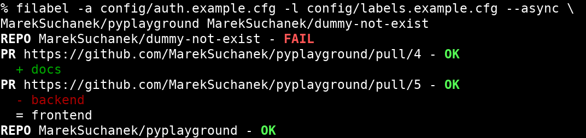

= filabel
:toc:
:note-caption: :information_source:
:warning-caption: :warning:

Tool for labeling PRs at GitHub by globs.

== Zadání úkolu 6

Vaším úkolem za 5 bodů je vytvořit asynchronní zpracování repozitářů,
pull requestů a jejich oštítkování v rámci aplikace `filabel` s použitím
knihovny https://aiohttp.readthedocs.io/en/stable/[aiohttp].

* Do implementace CLI nástroje `filabel` doplňte přepínač ``-x``/``--async``, který bude zpracovávat
  štítky v asynchronním režimu pomocí https://aiohttp.readthedocs.io/[aiohttp]:
** Pokud je zadáno více repozitářů v argumentech, pak se zpracovávají asynchronně.
** Získání seznamu pull requestů z více stránek musí být asynchronní (čeká se synchronně jen
   na první stránku).
** Zpracování jednotlivých pull requestů je asynchronní.
* Kvůli asynchronnímu zpracování má tento režim také jiný formát výstupu - viz ukázka.
* Popište tento nový režim v dokumentaci.
* (nepovinně) Rozšiřte vlastní jednotkové testy o testování práce v asynchronním režimu.
  Pozor ale, že betamax funguje pouze s knihovnou requests. Pro obecné mockování HTTTP komunikace doporučujeme vyzkoušet https://vcrpy.readthedocs.io/[vcrpy] (má trochu jiné API, ale principy zůstávají stejné).
* Původní funkcionalita musí zůstat zachována. Možností by bylo samozřejmě napsat zcela odděleně
  asynchronní logiku, ale znovupoužitím a případným upravením existujících částí kódu můžete
  ušetřit relativně hodně času (například Strategy pattern).

== Automatické testy

Veškeré dodané testy z minulých úkolů série filabel včetně vašich vlastních testů musí stále procházet.

Do `test/test_async.py` jsme přidali testy chování aplikace s přepínačem `-x/--async`. Tyto testy ale
neověřují, že se aplikace skutečně chová asynchronně podle požadavků, pracují s živým API a kontrolují
správnost výstupů.

Následuje text z minula, který stále platí:

NOTE: Před spuštěním testů předpokládejte, že je váš balíček nainstalován.
Toho můžete docílit například pomocí `python setup.py develop`
nebo `pip install -e.`

Testy ve složce `test_module` simulují reálnou instalaci
vašeho balíčku `filabel` z naklonovaného repozitáře i z testovací PyPI. Navíc testují
i další náležitosti požadované v tomto zadání (sdist bez warningů, submoduly, závislosti,
klíčová slova a další metadata). Tyto testy vyžadují nastavené proměnné prostředí
`CTU_USERNAME` a `FILABEL_REPO` pro získání vaší verze filabelu (pipem a gitem). V rámci
testů spouští subprocesy a pokud se na vašem OS jmenují jinak nebo jsou v jiné cestě, než
standardně na Linuxu, budete muset upravit soubor `fixtures/test_config.cfg`. V případě
potřeby založte issue. Tyto testy nepracují s aktuálním kódem „kolem nich“, ale s tím, co
je dostupné přes PyPI (publikováno) a GitHub (napushováno). Testy spustíte pomocí:

[source,console]
$ python -m pytest -v test_module

Pro spuštění testů nainstalujte do virtuálního prostředí balík `pytest`.

Testy vyžadují určitý setup repozitářů. Pro jeho vytvoření použijte skript
`test_environment/setup.sh`. Je třeba nastavit proměnné prostředí
`GH_TOKEN` a `GH_USER`.
Token musí příslušet danému uživateli a mít scope `repo`.

Skript využívá program https://hub.github.com/[hub],
který si *nejprve zprovozněte*.

Testy jsou napsané tak, že pokud váš program funguje dle zadání,
dají se pouštět opakovaně. Pokud ale dle zadání nefunguje,
je třeba smazat všechny štítky.
Alternativně můžete testovací repozitáře smazat pomocí skriptu
`test_environment/delete.sh` (potřeba scope `delete_repo`) a vytvořit znovu.
Vytváření repozitářů a Pull Requestů může trvat jednotky minut.

Pro spuštění testů nastavte stejné proměnné prostředí (`GH_TOKEN` a `GH_USER`).

[source,console]
$ export GH_USER=anicka
$ export GH_TOKEN=xxxxxxxxxxxxxxxxxxxxxxxxxxxxxxxxxxxxxxxx
$ python -m pytest -v test

Testy v souboru test_radioactive_waste.py trvají dlouho a mají potenciál
vyřadit vás na hodinu z přístupu ke GitHub API.
Když ladíte ostatní testy, doporučujeme je vypínat pomocí přepínače `-k`:

[source,console]
$ python -m pytest -v -k "not radioactive" test

Testy předpokládají, že se štítky mění podle běhu předchozích testů.
Nepouštějte tedy jednotlivé testy samostatně.

Testy si můžete zkopírovat k sobě do repozitáře, považujte je za Public Domain.
Nepřidejte ale do repozitáře omylem soubor `labels.real.cfg`,
který se v průběhu testů dočasně vytváří a obsahuje váš token.

NOTE: Testy proti živému API, navíc napsané tak,
že se jednotlivé testy navzájem ovlivňují, jsou ukázkou toho,
jak se to nemá dělat.
Pokud narazíte v testech na problém, nebo nevíte jak dál, zeptejte se.
K tomu, jak se to dělá pořádně, se v předmětu dostaneme později.

WARNING: Testy netestují barevnost výstupu. I neobarvený výstup projde testy.
Barevnost kontrolujte očima.

== Odevzdání úkolu

Odkazy na repozitář a balíček na testovací PyPI nám pošlete e-mailem.
Pro odevzdání v repozitáři nastavte tag `v0.6`.